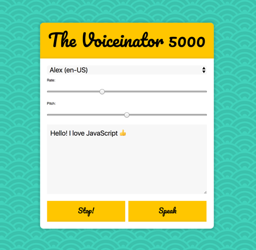

## JavaScript30 Day 23 - Speech Synthesis

In this tutorial, we learn speech synthesis API that comes in all modern browsers. We have our note ready and browser will voice out our note with input setting of speech rate and pitch.

[View demo site here.](https://webdevtuts.github.io/javascript30_23/)

